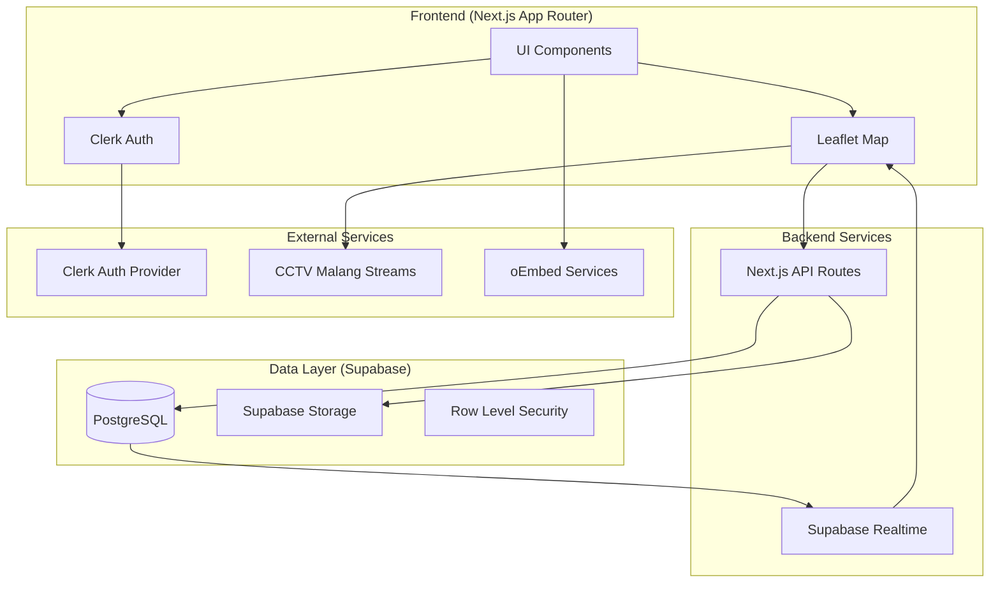

# Design Document: Flood Report System

## Overview

Sistem Laporan Banjir Real-time untuk Warga Malang adalah aplikasi web berbasis Next.js yang memungkinkan warga melaporkan dan memverifikasi kondisi banjir secara real-time. Sistem ini menggunakan peta interaktif Leaflet.js dengan color-coding berdasarkan ketinggian air, integrasi bukti digital dari media sosial, sistem time-stamp kedaluwarsa untuk validasi data, dan integrasi CCTV publik Kota Malang untuk verifikasi visual.

### Key Features
- Autentikasi via Clerk (social login)
- Peta interaktif dengan marker banjir berwarna (Kuning/Oranye/Merah)
- Laporan banjir dengan bukti digital (upload foto atau link sosmed)
- Sistem upvote/konfirmasi untuk validasi laporan
- Fitur "Jalur Aman" untuk menandai rute kering
- Integrasi CCTV publik Kota Malang
- UI Neobrutalism dengan dark mode default

## Architecture



## Components and Interfaces

### 1. Authentication Module

```typescript
// types/auth.ts
interface AuthUser {
  id: string;
  clerkId: string;
  email: string;
  name: string;
  avatarUrl?: string;
  createdAt: Date;
}
```

**Components:**
- `ClerkProvider` - Wrapper di root layout
- `SignInButton` / `SignUpButton` - Tombol autentikasi
- `UserButton` - Menu user yang sudah login

### 2. Map Module

```typescript
// types/map.ts
interface MapConfig {
  center: [number, number]; // Malang: [-7.9666, 112.6326]
  zoom: number;
  minZoom: number;
  maxZoom: number;
}

interface MapMarker {
  id: string;
  type: 'flood' | 'safe_route' | 'cctv';
  position: [number, number];
  data: FloodReport | SafeRoute | CCTVCamera;
}
```

**Components:**
- `MapContainer` - Container utama peta Leaflet
- `FloodMarker` - Marker banjir dengan color-coding
- `SafeRouteMarker` - Marker jalur aman (hijau)
- `CCTVMarker` - Marker CCTV (icon kamera)
- `MarkerPopup` - Popup dengan detail dan bukti
- `FilterControls` - Tombol filter peta

### 3. Flood Report Module

```typescript
// types/flood-report.ts
type WaterLevel = 'siaga' | 'bahaya' | 'evakuasi';

interface FloodReport {
  id: string;
  userId: string;
  latitude: number;
  longitude: number;
  waterLevel: WaterLevel;
  description?: string;
  proofType: 'image' | 'social_link';
  proofUrl: string;
  upvoteCount: number;
  lastConfirmedAt: Date;
  createdAt: Date;
  expiresAt: Date; // createdAt + 3 hours
}

interface CreateFloodReportInput {
  latitude: number;
  longitude: number;
  waterLevel: WaterLevel;
  description?: string;
  proofType: 'image' | 'social_link';
  proofUrl: string;
}
```

**Components:**
- `ReportButton` - Tombol "LAPOR" besar di bawah layar
- `ReportForm` - Form untuk input laporan
- `WaterLevelSelector` - Pilihan tingkat air
- `ProofUploader` - Upload foto atau paste link sosmed
- `UpvoteButton` - Tombol "Masih Banjir"

### 4. Safe Route Module

```typescript
// types/safe-route.ts
interface SafeRoute {
  id: string;
  userId: string;
  latitude: number;
  longitude: number;
  description?: string;
  upvoteCount: number;
  lastConfirmedAt: Date;
  createdAt: Date;
  expiresAt: Date;
}
```

### 5. CCTV Module

```typescript
// types/cctv.ts
interface CCTVCamera {
  id: string;
  name: string;
  streamId: string;
  latitude: number;
  longitude: number;
  district: string;
  street: string;
  cameraType: string;
  webrtcUrl: string;
  hlsUrl: string;
  status: number;
}
```

**Components:**
- `CCTVModal` - Modal untuk menampilkan stream CCTV
- `CCTVPlayer` - Video player untuk HLS stream

### 6. Social Media Embed Module

```typescript
// types/social-embed.ts
type SocialPlatform = 'instagram' | 'twitter' | 'tiktok';

interface SocialEmbedConfig {
  platform: SocialPlatform;
  url: string;
}

// Utility functions
function validateSocialUrl(url: string): SocialPlatform | null;
function extractEmbedUrl(url: string, platform: SocialPlatform): string;
```

**Components:**
- `SocialEmbed` - Render embed dari berbagai platform
- `InstagramEmbed` - Embed Instagram
- `TwitterEmbed` - Embed Twitter/X
- `TikTokEmbed` - Embed TikTok

## Data Models

### Supabase Database Schema

```sql
-- Users table (synced from Clerk)
CREATE TABLE users (
  id UUID PRIMARY KEY DEFAULT gen_random_uuid(),
  clerk_id TEXT UNIQUE NOT NULL,
  email TEXT NOT NULL,
  name TEXT,
  avatar_url TEXT,
  created_at TIMESTAMPTZ DEFAULT NOW()
);

-- Flood reports table
CREATE TABLE flood_reports (
  id UUID PRIMARY KEY DEFAULT gen_random_uuid(),
  user_id UUID REFERENCES users(id) ON DELETE CASCADE,
  latitude DECIMAL(10, 8) NOT NULL,
  longitude DECIMAL(11, 8) NOT NULL,
  water_level TEXT NOT NULL CHECK (water_level IN ('siaga', 'bahaya', 'evakuasi')),
  description TEXT,
  proof_type TEXT NOT NULL CHECK (proof_type IN ('image', 'social_link')),
  proof_url TEXT NOT NULL,
  upvote_count INTEGER DEFAULT 0,
  last_confirmed_at TIMESTAMPTZ DEFAULT NOW(),
  created_at TIMESTAMPTZ DEFAULT NOW(),
  expires_at TIMESTAMPTZ DEFAULT (NOW() + INTERVAL '3 hours')
);

-- Safe routes table
CREATE TABLE safe_routes (
  id UUID PRIMARY KEY DEFAULT gen_random_uuid(),
  user_id UUID REFERENCES users(id) ON DELETE CASCADE,
  latitude DECIMAL(10, 8) NOT NULL,
  longitude DECIMAL(11, 8) NOT NULL,
  description TEXT,
  upvote_count INTEGER DEFAULT 0,
  last_confirmed_at TIMESTAMPTZ DEFAULT NOW(),
  created_at TIMESTAMPTZ DEFAULT NOW(),
  expires_at TIMESTAMPTZ DEFAULT (NOW() + INTERVAL '3 hours')
);

-- Upvotes table (to prevent duplicate upvotes)
CREATE TABLE upvotes (
  id UUID PRIMARY KEY DEFAULT gen_random_uuid(),
  user_id UUID REFERENCES users(id) ON DELETE CASCADE,
  report_id UUID,
  report_type TEXT NOT NULL CHECK (report_type IN ('flood', 'safe_route')),
  created_at TIMESTAMPTZ DEFAULT NOW(),
  UNIQUE(user_id, report_id, report_type)
);

-- Enable Row Level Security
ALTER TABLE users ENABLE ROW LEVEL SECURITY;
ALTER TABLE flood_reports ENABLE ROW LEVEL SECURITY;
ALTER TABLE safe_routes ENABLE ROW LEVEL SECURITY;
ALTER TABLE upvotes ENABLE ROW LEVEL SECURITY;

-- RLS Policies
CREATE POLICY "Users can read all users" ON users FOR SELECT USING (true);
CREATE POLICY "Users can update own profile" ON users FOR UPDATE USING (auth.uid()::text = clerk_id);

CREATE POLICY "Anyone can read flood reports" ON flood_reports FOR SELECT USING (true);
CREATE POLICY "Authenticated users can create flood reports" ON flood_reports FOR INSERT WITH CHECK (auth.uid() IS NOT NULL);
CREATE POLICY "Users can update own reports" ON flood_reports FOR UPDATE USING (user_id = auth.uid());

CREATE POLICY "Anyone can read safe routes" ON safe_routes FOR SELECT USING (true);
CREATE POLICY "Authenticated users can create safe routes" ON safe_routes FOR INSERT WITH CHECK (auth.uid() IS NOT NULL);

CREATE POLICY "Anyone can read upvotes" ON upvotes FOR SELECT USING (true);
CREATE POLICY "Authenticated users can create upvotes" ON upvotes FOR INSERT WITH CHECK (auth.uid() IS NOT NULL);
```

### CCTV Data (Static JSON)

Data CCTV akan di-load dari file `cctv_organized.json` yang sudah ada, dikelompokkan berdasarkan kecamatan (Klojen, Blimbing, Lowokwaru, Sukun, Kedungkandang).


## Correctness Properties

*A property is a characteristic or behavior that should hold true across all valid executions of a system-essentially, a formal statement about what the system should do. Properties serve as the bridge between human-readable specifications and machine-verifiable correctness guarantees.*

Based on the acceptance criteria analysis, the following correctness properties must be verified through property-based testing:

### Property 1: Water Level to Color Mapping

*For any* flood report with a valid water level, the system SHALL map it to the correct marker color:
- `siaga` → Yellow (#FFEB3B)
- `bahaya` → Orange (#FF9800)
- `evakuasi` → Red (#F44336)

**Validates: Requirements 2.2**

### Property 2: Report Expiry Opacity Calculation

*For any* flood report or safe route, the marker opacity SHALL be calculated based on time since last confirmation:
- If `lastConfirmedAt` is within 3 hours: opacity = 1.0 (full)
- If `lastConfirmedAt` exceeds 3 hours: opacity = max(0.3, 1.0 - (hoursElapsed - 3) * 0.1)

This property applies equally to both flood reports and safe routes.

**Validates: Requirements 2.4, 6.3**

### Property 3: Report Validation

*For any* report submission attempt:
- The water level MUST be one of: 'siaga', 'bahaya', 'evakuasi'
- The latitude MUST be a valid number between -90 and 90
- The longitude MUST be a valid number between -180 and 180
- Invalid inputs SHALL be rejected with appropriate error messages

**Validates: Requirements 3.3, 3.5**

### Property 4: Report Persistence Round-Trip

*For any* valid flood report that is submitted, querying the database SHALL return a report with identical values for: latitude, longitude, waterLevel, proofType, and proofUrl.

**Validates: Requirements 3.4**

### Property 5: Social URL Validation

*For any* URL string, the validation function SHALL correctly identify:
- Valid Instagram URLs (instagram.com/p/*, instagram.com/reel/*)
- Valid Twitter/X URLs (twitter.com/*/status/*, x.com/*/status/*)
- Valid TikTok URLs (tiktok.com/@*/video/*)
- Invalid URLs SHALL return null/false

**Validates: Requirements 4.1**

### Property 6: Upvote Updates Report State

*For any* flood report that receives an upvote:
- The `upvoteCount` SHALL increment by 1
- The `lastConfirmedAt` SHALL be updated to current timestamp
- The `expiresAt` SHALL be reset to current timestamp + 3 hours

**Validates: Requirements 5.2**

### Property 7: Filter Returns Correct Subset

*For any* set of markers and applied filter:
- "Bisa Lewat Mobil" filter SHALL return only markers where `waterLevel === 'siaga'` OR `type === 'safe_route'`
- "Lumpuh Total" filter SHALL return only markers where `waterLevel === 'evakuasi'`
- The filtered set SHALL be a subset of the original set

**Validates: Requirements 7.1, 7.2**

### Property 8: CCTV Proximity Detection

*For any* flood report location and set of CCTV cameras, the system SHALL correctly identify all CCTVs within 200 meters using the Haversine formula. The distance calculation SHALL be accurate within 1 meter tolerance.

**Validates: Requirements 8.5**

## Error Handling

### Client-Side Errors

| Error Type | Handling Strategy |
|------------|-------------------|
| Network failure | Show toast notification, enable offline mode for viewing cached data |
| Invalid form input | Display inline validation errors, prevent submission |
| Geolocation denied | Show manual location picker, allow address search |
| Image upload failure | Retry with exponential backoff, suggest social link alternative |
| CCTV stream unavailable | Show "Stream tidak tersedia" message with retry button |

### Server-Side Errors

| Error Type | Handling Strategy |
|------------|-------------------|
| Database connection failure | Return 503 with retry-after header |
| Invalid authentication | Return 401, redirect to login |
| Rate limiting | Return 429 with remaining time |
| Validation failure | Return 400 with detailed error messages |

### Real-time Subscription Errors

```typescript
// Handle Supabase realtime errors
supabase
  .channel('flood_reports')
  .on('postgres_changes', { event: '*', schema: 'public', table: 'flood_reports' }, handler)
  .on('error', (error) => {
    console.error('Realtime subscription error:', error);
    // Attempt reconnection with exponential backoff
    reconnectWithBackoff();
  })
  .subscribe();
```

## Testing Strategy

### Property-Based Testing Library

We will use **fast-check** for property-based testing in TypeScript/JavaScript. This library provides:
- Arbitrary generators for complex data types
- Shrinking for minimal failing examples
- Integration with Jest/Vitest

### Configuration

```typescript
// vitest.config.ts
import { defineConfig } from 'vitest/config';

export default defineConfig({
  test: {
    globals: true,
    environment: 'jsdom',
    setupFiles: ['./src/test/setup.ts'],
  },
});
```

### Property-Based Test Structure

Each property-based test MUST:
1. Run a minimum of 100 iterations
2. Include a comment referencing the correctness property from this design document
3. Use the format: `**Feature: flood-report-system, Property {number}: {property_text}**`

Example structure:

```typescript
import * as fc from 'fast-check';
import { describe, it, expect } from 'vitest';

describe('Flood Report System Properties', () => {
  /**
   * **Feature: flood-report-system, Property 1: Water Level to Color Mapping**
   * Validates: Requirements 2.2
   */
  it('should map water levels to correct colors', () => {
    fc.assert(
      fc.property(
        fc.constantFrom('siaga', 'bahaya', 'evakuasi'),
        (waterLevel) => {
          const color = getMarkerColor(waterLevel);
          const expectedColors = {
            siaga: '#FFEB3B',
            bahaya: '#FF9800',
            evakuasi: '#F44336',
          };
          return color === expectedColors[waterLevel];
        }
      ),
      { numRuns: 100 }
    );
  });
});
```

### Unit Testing

Unit tests will cover:
- Component rendering
- User interactions (click handlers, form submissions)
- API route handlers
- Utility functions

### Integration Testing

Integration tests will verify:
- Clerk authentication flow
- Supabase database operations
- Real-time subscription updates
- CCTV stream loading

### Test File Organization

```
src/
├── lib/
│   ├── utils/
│   │   ├── color-mapping.ts
│   │   ├── color-mapping.test.ts
│   │   ├── expiry-calculation.ts
│   │   ├── expiry-calculation.test.ts
│   │   ├── validation.ts
│   │   ├── validation.test.ts
│   │   ├── social-url.ts
│   │   ├── social-url.test.ts
│   │   ├── filter.ts
│   │   ├── filter.test.ts
│   │   ├── distance.ts
│   │   └── distance.test.ts
│   └── ...
├── components/
│   ├── Map/
│   │   ├── FloodMarker.tsx
│   │   ├── FloodMarker.test.tsx
│   │   └── ...
│   └── ...
└── test/
    ├── setup.ts
    └── properties/
        └── flood-report.property.test.ts
```
